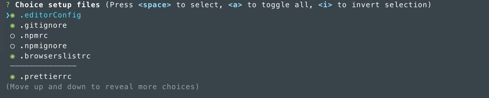
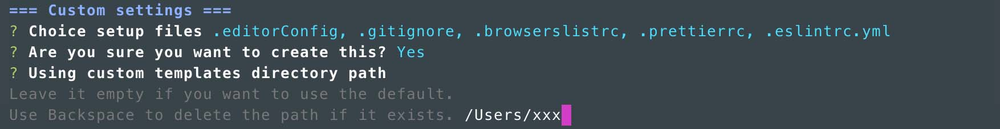

# Preset setup files

You can use commands to generate files that are often used in web production.

## Install

```shell
# npm
$ npm install -g @io-arc/preset-setup-files

# yarn
$ yarn add global @io-arc/preset-setup-files
```

## Usage

### Default

Execute the command in the directory where you want to set the file.

```shell
$ cd <target directory>
$ preset-setup-files
```



### Custom configuration

In custom mode, you can below.

- Default choices
- Template directory to browse

Custom settings will be recorded in `.preset-setup-files-config.json` in your home directory.

```shell
$ preset-setup-files --custom
```

**Default choices**  
\* Same as default command, but not copy files


**Template directory to browse**  


#### Remove custom settings

Delete `.preset-setup-files-config.json`.

### See configuration

Check the current settings.

```shell
$ preset-setup-files --config
# or
$ preset-setup-files -c
```


## Request

If you have a template you would like to see added, please suggest it in Issues.
